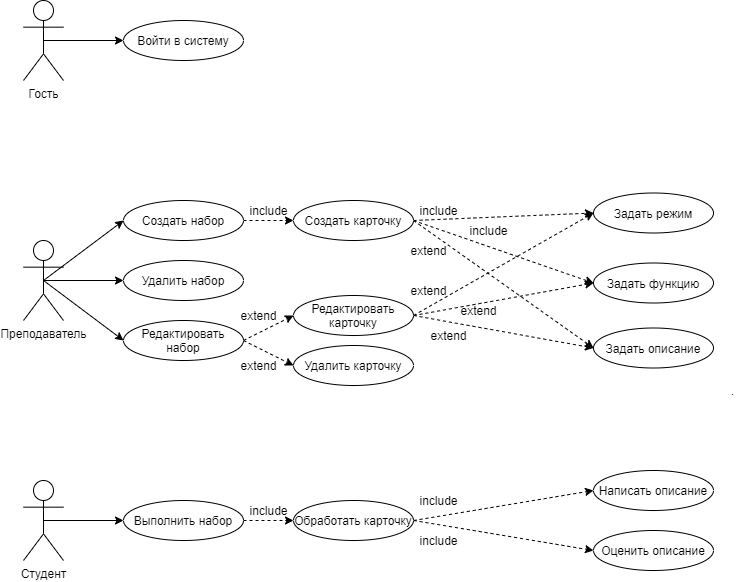

# Describe-me

Figma - https://www.figma.com/file/TD9Mrz7LARoAlIM8o2jR6U/describe.me?node-id=0%3A1

### Цель работы

Создание Web-приложения для взаимодействия с карточками и набором карточек, которые содержат описания для функций.

### Перечень функциональных требований

Пользователь с **ролью преподавателя** должен иметь возможность создавать, редактировать и удалять наборы карточек, а также создавать, редактировать и удалять конкретные карточки, в которых задаётся режим оценивания или создания, функция и само описание, в случае режима оценивания.

Пользователь с **ролью студента** должен иметь возможность просматривать наборы карточек, а также создавать своё или оценивать чужое описание функции.

### Use-case диаграмма

### ER-диаграмма сущностей системы
